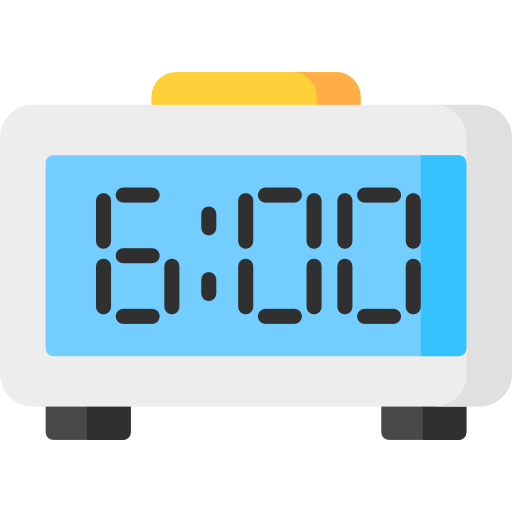
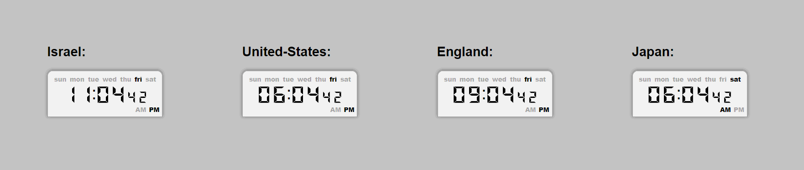

# Digital-Clock-React

### This NPM package provides a digital clock component for ReactJS applications. The component is built using ReactJS, JavaScript, and SASS to provide a user-friendly and visually appealing clock feature that can be easily integrated into any application. <br />



---

## Configuration Options

### This digital clock component offers a variety of configuration options to customize its appearance and functionality, including:

- **size**: The clock face can be displayed in 3 sizes: large, medium, small.
- **timestamp**: The clock can display a specific timestamp, allowing you to represent any given time.
- **isMode24H(24/12 Hours Mode)**: The clock can be displayed in either 12-hour or 24-hour mode.
- **useInterval**: Its optional to use the clock as static clock, and to turn off the interval.

</br>

## Usage

**Example of using the clock in react app file, customized with the mentioned props**:

```js
import React from "react";
import { Clock } from "digital-clock-react";

function App() {
  return (
    <div className="app-container">
      <Clock
        isMode24H
        size="small"
        useInterval={false}
        timestamp={MY_REGION_TIMESTAMP}
      />
    </div>
  );
}

export default App;
```

**Installation:**</br>
run the following command on your terminal:</br> _`npm install digital-clock-react`_

---

### **Example of using the clock component:**



---

## Author

:octocat: **Afek Sakaju**

- LinkedIn: [@afeksa](https://www.linkedin.com/in/afeksa/)
- GitHub: [@afekTheMiniLearner](https://github.com/afekTheMiniLearner)
