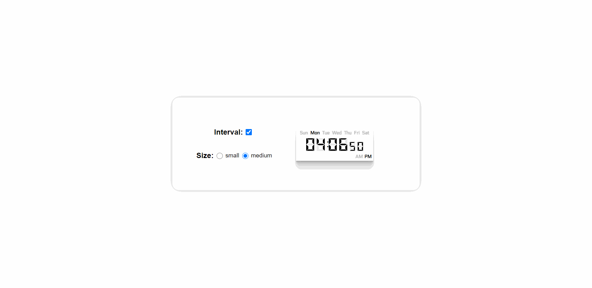

# Digital-Clock-React

### This NPM package presents a digital clock component tailored for ReactJS applications. It utilizes ReactJS, JavaScript, SASS, and ESLint to create an intuitive and visually appealing clock feature. With easy integration capabilities, it seamlessly becomes a part of any application, enhancing its functionality. <br />


---

**Live demo:** </br>[digital-clock-react](http://afektheminilearner.github.io/digital-clock-react)

---

## Configuration Options

### The digital clock component offers a variety of configuration options to customize its appearance and functionality, including:

- **size**: You have the option to showcase the clock face in two sizes: medium or small.
- **timestamp**: The clock has the capability to exhibit a precise timestamp, enabling you to depict any desired time.
- **isMode24H(24/12 Hours Mode)**: The clock offers the flexibility to be presented in either the 12-hour or 24-hour format.
- **useInterval**: You can optionally use the clock as a static display by turning off the interval.

</br>

## Usage:

```js
import React from "react";
import { Clock } from "digital-clock-react";
import { myTimestamp } from "./consts";

function App() {
  return (
    <div className="app-container">
      <Clock
        isMode24H
        size="small"
        useInterval={false}
        timestamp={myTimestamp}
      />
    </div>
  );
}

export default App;
```

**Installation:**</br>

- `npm install digital-clock-react` <br /> Include the package in your project's dependencies.

---

### **Here's an example showcasing the utilization of the clock component:**



---

## Author

:octocat: **Afek Sakaju**

- LinkedIn: [@afeksa](https://www.linkedin.com/in/afeksa/)
- GitHub: [@afekTheMiniLearner](https://github.com/afekTheMiniLearner)
